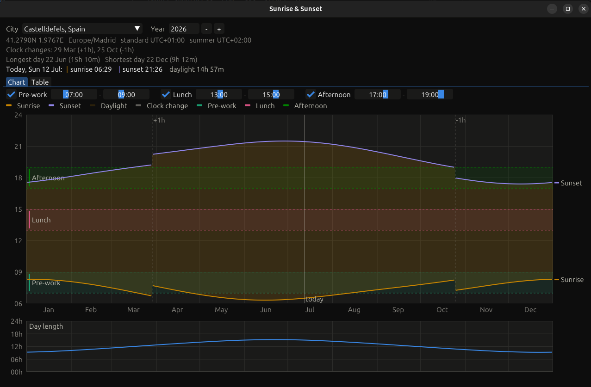

# Sunrise & Sunset

Desktop app (SDL3 + Dear ImGui) that shows sunrise and sunset times for a
chosen city across a whole year, as a daylight chart and as a day-by-day table.



- Solar times are computed with the NOAA solar-position algorithm (accuracy
  about ±1–2 minutes) in UTC.
- Conversion to the city's wall clock goes through the system tz database
  (IANA zones), so daylight-saving time — including southern-hemisphere rules
  and historical rule changes — is always correct for the selected year.
- Clock-change days are marked on the chart (dashed lines) and highlighted in
  the table; polar day/night at high latitudes is handled.

## Build

### Prerequisites on Linux: SDL3

The project needs the SDL3 development files, found through `pkg-config`. On
recent distributions install the package:

```sh
sudo apt install libsdl3-dev        # Ubuntu 24.10+ / Debian 13
sudo dnf install SDL3-devel         # Fedora 40+
sudo pacman -S sdl3                 # Arch
```

On distributions without an SDL3 package yet (e.g. Ubuntu 24.04), build it
from source once — it installs to `/usr/local`:

```sh
sudo apt install build-essential cmake git pkg-config \
  libx11-dev libxext-dev libwayland-dev libxkbcommon-dev libegl1-mesa-dev
git clone --depth 1 --branch release-3.2.16 https://github.com/libsdl-org/SDL
cmake -S SDL -B SDL/build -DCMAKE_BUILD_TYPE=Release -DSDL_TESTS=OFF -DSDL_EXAMPLES=OFF
cmake --build SDL/build -j
sudo cmake --install SDL/build
sudo ldconfig
```

### Building the app

```sh
cmake -S . -B build -DCMAKE_BUILD_TYPE=Release
cmake --build build -j
./build/sunset
```

On Windows (MSVC), download the [SDL3 VC devel package](https://github.com/libsdl-org/SDL/releases)
and point CMake at it; timezone conversion uses C++20 `std::chrono` there
instead of the POSIX tz database:

```sh
cmake -B build -DCMAKE_PREFIX_PATH=C:/path/to/SDL3-3.2.16
cmake --build build --config Release
```

## Usage

- Pick a city (type in the combo to filter) and a year (1900–2100).
- **Chart** tab: daylight band with sunrise/sunset curves (local wall-clock
  time) and a day-length chart below. Hover for exact values per day.
- Three configurable period bands (pre-work, lunch, afternoon) overlay the
  chart to show which parts of those periods have daylight through the year.
  Toggle and adjust them above the chart; values persist in `config.ini`
  (created next to the working directory on first run, editable by hand).
- **Table** tab: every day with sunrise, sunset, solar noon, day length,
  change vs the previous day, and UTC offset; filter by month.
- `./build/sunset --selftest [year]` prints solstice values and clock-change
  dates for a few cities, for checking against published almanac data.
